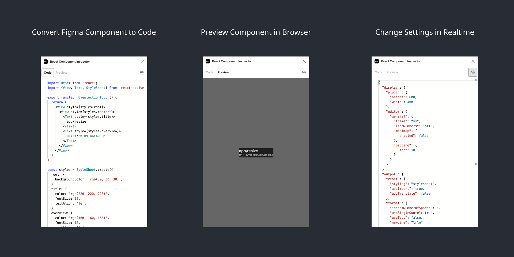

  

<h1 align="center">
  Figma → React Native
</h1>
<h3 align="center">
  <a href="https://www.figma.com/community/plugin/821138713091291738">
    View plugin on Figma Community
  </a>
</h3>

This plugin transforms Figma components to React Native components in real time. The goal is to reduce the handoff time between design and development. Design your UI components in Figma and export them for use in your React Native app.

## Getting started

[Run the plugin](https://www.figma.com/community/plugin/821138713091291738). Open it in Figma and select a [Figma component](https://help.figma.com/hc/en-us/articles/360038662654-Guide-to-Components-in-Figma). The plugin will generate React component code and render a preview. To change the settings, click the cog icon and edit the JSON. Settings will save and update in real time. You can change the configuration of the editor, plugin, compiler, code output, and more.

## Features

- SVGs and images
- Nested components
- Variants and properties
- AutoLayout to FlexBox
- Conditional rendering
- Background gradients
- Borders and rounding
- Shadows and rotations
- Storybook generation
- Component JSDoc generation
- Theme generation from styles
- Realtime code and preview rendering
- Flexible and realtime configuration
- Batch exporting components
- Figma dark mode support :)

## Community

- [Discord Channel](https://discord.com/invite/TzhDRyj)
- [Figma Forums](https://forum.figma.com/t/react-component-generator/14236)
- [Discussions](https://github.com/kat-tax/figma/discussions)
- [Issues](https://github.com/kat-tax/figma/issues)

This plugin is open source. It does not require an account, remote service, or any other bullsh*t.
